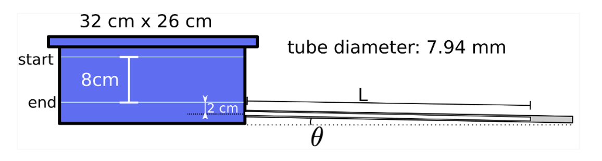
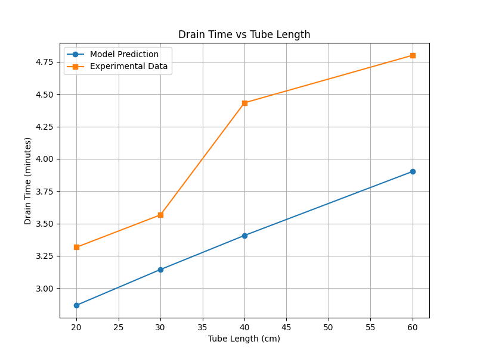
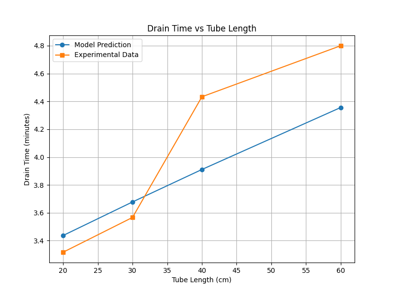

# Pipe Flow Losses Analysis

This project explores fluid dynamics in piping systems, focusing on energy losses and flow characteristics. It examines both major and minor losses to provide a comprehensive understanding of flow behavior in pipes, including frictional effects and localized disturbances.

## Highlights
1. **Major Losses**: Energy losses due to friction along the length of the pipe, influenced by factors such as pipe material, length, diameter, and flow velocity.
2. **Minor Losses**: Energy losses at pipe inlets, outlets, bends, valves, and fittings caused by turbulence and flow disturbances.
## Figures
1. **Figure 1**: Entrance losses visualization.

2. **Figure 2**: Exit losses visualization.

